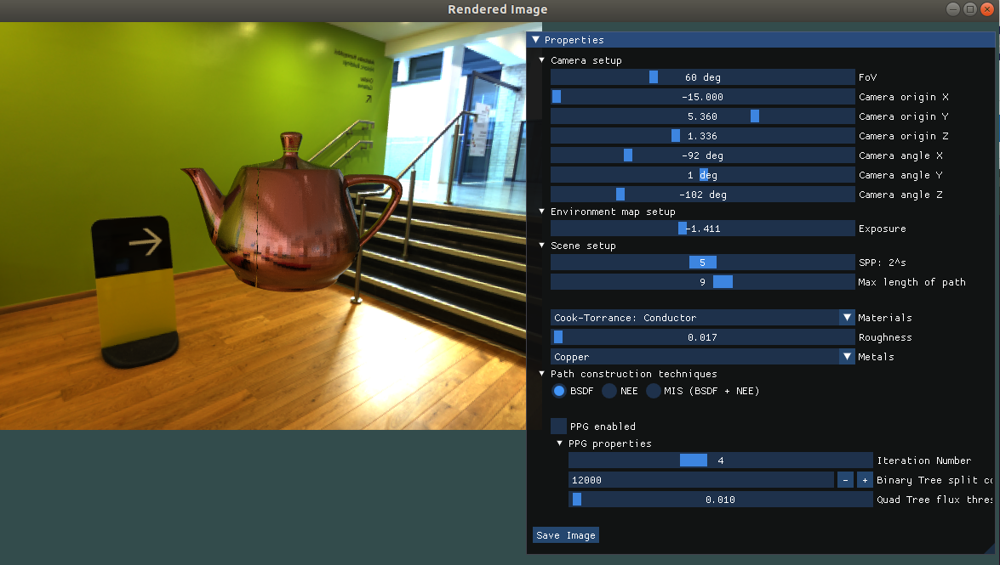
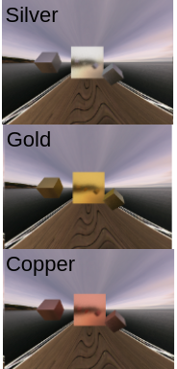

# Lightweight C++ ray tracer from scratch!
A lightweight, CPU‑only C++ ray tracer created for the practical course **Graphics and Game Development**.  
It builds and runs on **Ubuntu** and **macOS**.

## Preview of this project <a name="screenshots"></a>


<a name="screenshots"></a>

## Different levels of depth <a name="screenshots"></a>
<video src="images/depth.mp4"
       autoplay
       loop
       muted
       playsinline
       style="max-width:100%; height:auto;">
  Your browser does not support the video tag.
</video>

<a name="screenshots"></a>

## Different samples per pixel (SPP) <a name="screenshots"></a>

<video src="images/spp.mp4"
       autoplay
       loop
       muted
       playsinline
       style="max-width:100%; height:auto;">
  Your browser does not support the video tag.
</video>


---

## 📚 Table of Contents
1. [Prerequisites](#prerequisites)  
2. [Build & Run](#build--run)  
3. [Graphical User Interface](#graphical-user-interface)  
4. [Features](#features)  
5. [Supported Materials](#supported-materials)  
6. [Screenshots](#screenshots)  
7. [References](#references)  

---

## Prerequisites <a name="prerequisites"></a>
- **glm** – clone from <https://github.com/g-truc/glm>  
- **glfw** – clone from <https://github.com/glfw/glfw>  

Place both repositories inside the `lib/` folder:
```bash
lib/
├─ glm/
└─ glfw/
```
The environment maps are **not** part of the repository.  
Download an HDRI from **PolyHaven** (<https://polyhaven.com/hdris>), move it to the corresponding scene folder, and rename it exactly like the scene file (e.g., `teapot_copper.hdr`).


*The name of the active scene can be changed in `main.cpp`.*

---  

## 🛠️ Build & Run
```bash
# Create a build directory and enter it
mkdir build && cd build

# Configure the project
cmake ..

# Compile (using up to 5 cores)
make -j5

# Return to the project root
cd ..

# Run the renderer
./render
```
## 🎛️ Graphical User Interface <a name="graphical-user-interface"></a>
The GUI lets you tweak the renderer in real time.

### Camera
- **Field of View** (FOV)  
- **Origin** (3‑D vector)  
- **Rotation** (pitch, yaw, roll)  

### Environment Map
- **Exposure**  

### Scene Settings
- **Samples per pixel** (spp)  
- **Maximum path length** (depth)  

### Materials
- **Color**  
- **Index of Refraction** (IOR)  
- **Roughness**  
- **Metal type**  

### Advanced Options
- **BSDF** selection  
- **Next‑Event Estimation** (NEE)  
- **Multiple Importance Sampling** (MIS)  
- **Practical Path Guiding** (PPG)  
  - Iteration number  
  - Binary‑tree split constant  
  - Quad‑tree flux threshold  

### Output
- Save the rendered image to disk.

---  

## ✨ Features <a name="features"></a>
- Simple OBJ loader with XML support  
- Environment‑map lighting  
- BVH acceleration structure  
- Multi‑threaded processing  
- Material system with various BRDFs  
- Path tracing with:
  - BSDF sampling  
  - NEE sampling  
  - MIS (balanced heuristic)  
  - Practical Path Guiding (PPG)  

---  

## 📚 Supported Materials <a name="supported-materials"></a>
- Normals (debug view)  
- Perfect diffuse  
- Perfect flat mirrors  
- Rough conductors*  
- Rough dielectrics* 

## Examples of metalic materials



*Implemented following **Microfacet Models for Refraction through Rough Surfaces** (Cornell, 2007) – https://www.cs.cornell.edu/~srm/publications/EGSR07-btdf.pdf

---  


## 📖 References <a name="references"></a>
- **Practical Path Guiding for Efficient Light Transport Simulation** – Disney Research (2019)  
  https://studios.disneyresearch.com/wp-content/uploads/2019/03/Practical-Path-Guiding-for-Efficient-Light-Transport-Simulation.pdf

---  